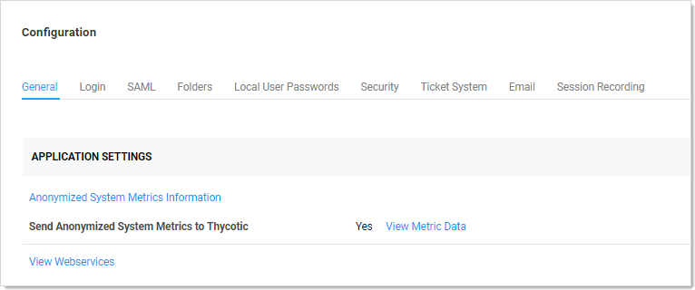
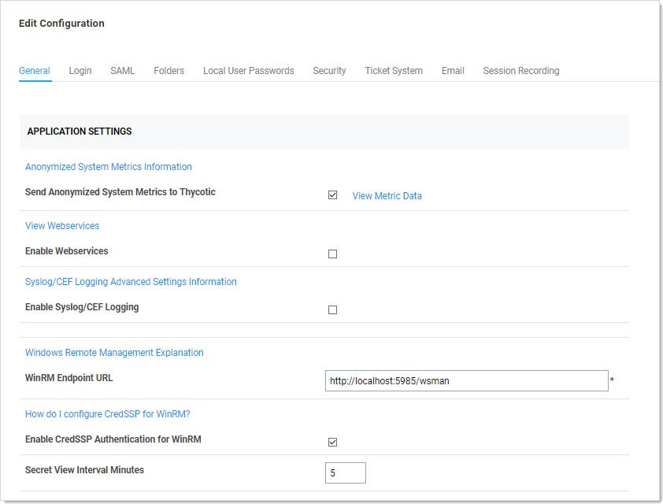
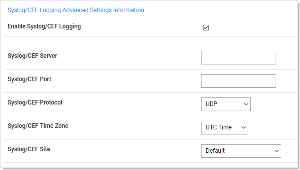

[title]: # (Configuration and Event Log Analysis)
[tags]: # (configuration)
[priority]: # (101)
# Initial Configuration and Event Log Analysis

Use the steps below to quickly configure Secret Server and Splunk. To setup your external
audit server to gather events that you can export from Secret Server:

1. Navigate to __Admin | Configuration.__

   
1. Click the __Edit__ button at the bottom of the page.

1. If necessary, click the __General__ tab.

   
1. Scroll down to the __Syslog/CEF Logging…__ section:

1. Click to enable the __Syslog/CEF Logging__ checkbox. The Syslog/CEF
    Logging… section appears:

   
1. Type the Splunk server's IP address in the __Syslog/CEF Server__ text box.

1. Type the Splunk server's port in the __Syslog/CEF Port__ text box.

1. Click to select the __Syslog/CEF Protocol__ dropdown list and select
    __TCP__.

1. Click to select the __Syslog/CEF Site__ dropdown list and select __Local__.

1. Click the __Save__ button at the bottom of the page.