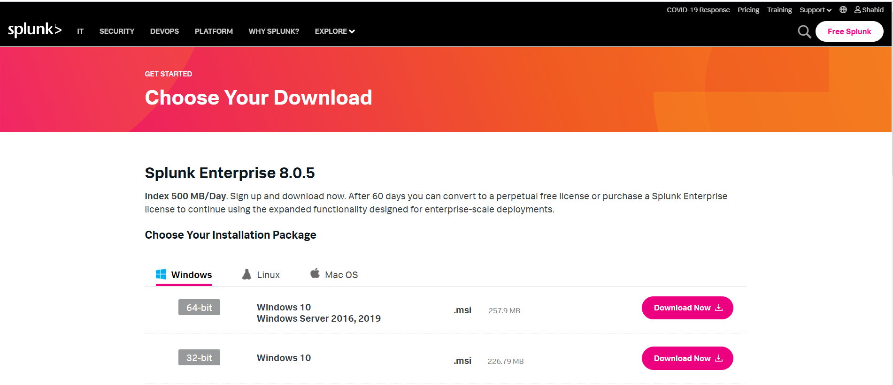
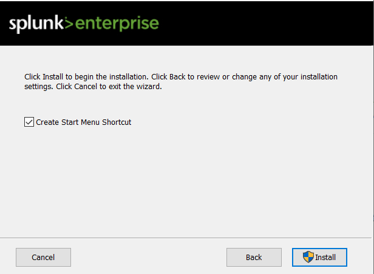

[title]: # (Setting up the Windows heavy forwarder)
[tags]: # (heavy forwarder)
[priority]: # (103)
# Setting up the Windows heavy forwarder to forward data to the splunk cloud

Setting up a [heavy](https://docs.splunk.com/Splexicon:Heavyforwarder) forwarder is a two-step process:

1. __Install a full Splunk Enterprise instance__

   a. Download splunk enterprise 8.0.5 from the splunk site and click on __Download Now__.

   
   b. Double-click the MSI file to start the installation:
    **splunk-8.0.5-a1a6394cc5ae-x64-release.msi**

   c. Check the **Check this box to accept the License Agreement** checkbox, and click on next.

   
   d. Create username and password and then click on next

   
   e. Click on install

   
1. Enable your Splunk Enterprise instance as a heavy forwarder. Set up heavy forwarding with Splunk Web:**

1.  After installation log in to Splunk Web as admin on the instance that will be forwarding data

1.  Click **Settings** \> **Forwarding and receiving**.  

   
1.  Select **Forwarding defaults**.  

   

1.  Select **yes** to store and maintain a local copy of the indexed data on the forwarder.  

   
1. At Configure forwarding, click **Add new**.  

   
1. Enter the hostname or IP address for the receiving Splunk instance(s), along with the **receiving port** specified when the receiver was configured. For example, you might enter **receivingserver.com:9997.**

   
1. Click Save.
1. Navigate to **Server Control** by clicking on **Setting** \> **Server Control.**
   
   
1.  Click on **Restart Splunk**

   
1.  **Download the SPL package from your splunk cloud.** It is not the regular universal forwarder exe you get from splunk (no need to install the separate universal forwarder software).<https://yourcloudname.splunkcloud.com/en-US/app/splunkclouduf/setupuf>

1. On the Splunk Cloud Home page, click **Download Universal Forwarder
    Credentials** to download the splunkclouduf.spl file.

   
1. When prompted, click **Save File** and click **OK**. By default,
the splunkclouduf.spl file downloads to the Downloads directory. If you download to a different location, make note of that location.

1. Move the splunkclouduf.spl file to the `C:\\ProgramFiles\\Splunk\\etc\\apps directory of your enterprise.`
1. Open a command prompt window and run the following command

1. tar xvf splunkclouduf.spl.

1. Navigate to the /bin subdirectory of your deployment server.

1. In the command prompt window, Run the following command on your Splunk Heavy Forwarder (or whatever path you install splunk too) :

    **splunk install app \<full path to splunkclouduf.spl\> -auth
    \<username\>:\<password\>** where \<full path to splunkclouduf.spl\> is the
    path to the directory where the splunkclouduf.spl file is located
    and \<username\>:\<password\> are the username and password of splunk
    enterprise.

1. Restart your forwarder: /splunk restart.

1. Once splunk is restarted you'll need to check the correct **output.conf** is install

1. Make sure that
    C:\\ProgramFiles\\Splunk\\etc\\apps\\yourcloudnamesplunkcloud\\default\\outsputs.conf 
    is the same as C:\\Program Files\\Splunk\\etc\\system\\local\\outputs.conf

1. If the files above aren't the same,
    copy C:\\ProgramFiles\\Splunk\\etc\\apps\\yourcloudnamesplunkcloud\\default\\outsputs.conf to C:\\Program
    Files\\Splunk\\etc\\system\\local\\outputs.conf and restart splunk.

## Configuring Secret Server settings

__To configure Secret Server settings:__

1. Sign into **Secret Server**.

   
1. The **Home** page appears.

   
1. Click **Admin** \> **Configuration**. The **Configuration** page appears.

   
1. At the bottom of the page, click **Edit**.  

   
1. The **Edit Configuration** page appears.  

   
1. Select the **Enable Webservices** settings check box.

1. Under the **Syslog/CEF Logging Advanced Settings Information** area, select the **Enable Syslog/CEF Logging** check box and enter the **syslog server**

   >**Note:** This should be the ip of machine/server where splunk enterprise is configured).

   

1. At the end of the page, click **Save**.  

   

## Configuration in Splunk enterprise

1. Go to **Splunk enterprise** \> **Settings** \> **Add Data** \> Click on **Monitor**.

1. The **Select Source** page appears. On the left-hand side, click
    **TCP/UDP.**

1. On right hand side, select UDP/TCP and enter the port which we have
    configured in Secret Server Eg: - TCP 6514.  

   
1. Click **Next**. On **Input Settings** page select source type as syslog.  

   

1. In the **Index** list, select **Default**.
1. Click **Review**. The **Review** page appears, review the information.
1. Click **Submit**. The message “**File input has been created successfully.**” Appears

   
1. Click **Start Searching**. The **New Search** page appears.
1. In the **New Search** text box, type the query and click Search icon.

   

   

## Accessing Secret Server Events in the SplunkCloud

Login to splunk cloud and click on **search and Reporting and** enter the query**: source=”syslog” and click Search** icon

   

   
