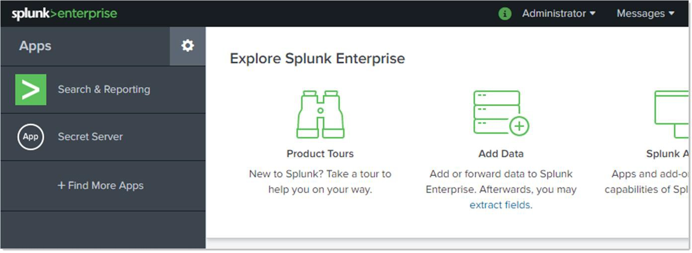
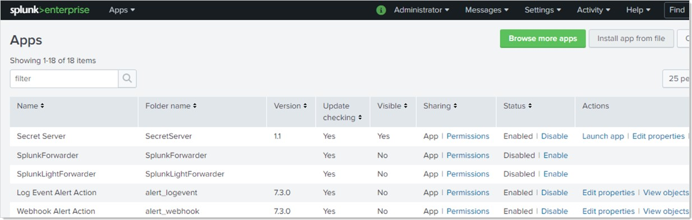
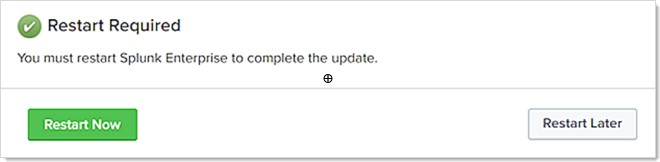

[title]: # (Installing the Splunk App for Secret Server)
[tags]: # (configuration)
[priority]: # (103)
# Installing the Splunk App for Secret Server

1. Download the Splunk App (splunk-app-for-secret-server_11.tgz) for SS at https://splunkbase.splunk.com/.

1. In the search text box, type `Splunk App for Secret Server` and press **\<Enter\>**.

1. The app's page appears (not shown).

1. Click the **Download** button.

1. Log into Splunk Enterprise:

   
1. Click the gear icon next to **Apps**, and select **Install App from File**.
    The Apps page appears:

   
1. Click the **Install app from file** button. A file selection dialog box appears.

1. Click the **Choose File** button.

1. Locate and select the file you downloaded early.

1. Click the **Upload** button. The Restart Required dialog box appears:

   
1. Click the **Restart Now** button. Splunk Enterprise restarts.