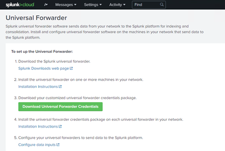
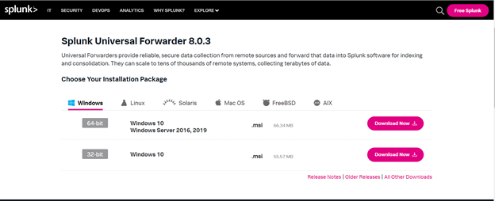
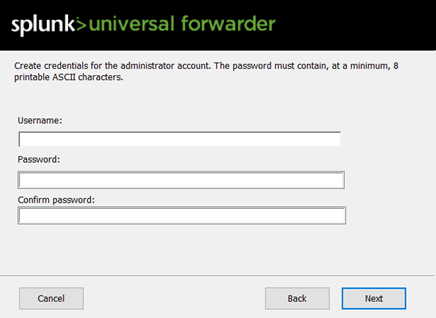
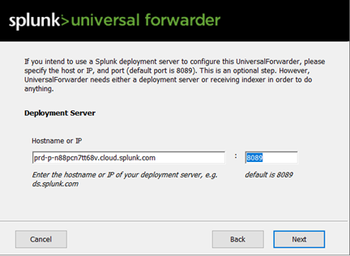
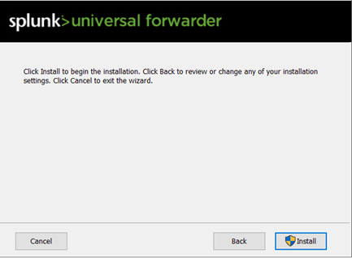
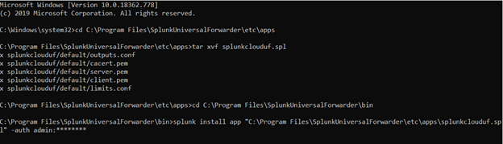

[title]: # (Setting up the Universal Forwarder)
[tags]: # (universal forwarder)
[priority]: # (104)
# Setting up the Universal Forwarder

Before a forwarder can forward data, it must have a configuration.

   * Tells the forwarder what data to send.
   * Tells it where to send the data.

Because the universal forwarder does not have Splunk Web, we must give the forwarder a configuration during the installation.
Install and configure Universal Forwarder on the server machine where Secret Server is installed. To install and configure Universal Forwarder:

1. Login to __Splunk Cloud__ with valid credentials.
1. On the left-hand side, click Universal Forwarder. The Universal Forwarder window appears.

   
1. Click on 1st link [Splunk Downloads web page](https://www.splunk.com/en_us/download/universal-forwarder.html) as mentioned on the screen above.

   

   >**Note:** Choose an appropriate __Installation Package__.

   

1. Double-click the MSI file to start the installation: __splunkforwarder-8.0.3-a6754d8441bf-x64-release.msi__.
1. Check the __Check this box to accept the License Agreement__ checkbox, and uncheck the __Use this Universal Forwarder with on-premises Splunk Enterprise...__ checkbox.

   
1. Create credentials for the admin account.

   
1. Enter the __hostname__ of Splunk cloud and port __8089__.
1. Click __Install__.

   
1. After configuration of universal forwarder navigate to the __Splunk Cloud Home page__.

1. Click __Universal Forwarder__.
1. On the Splunk Cloud Home page, click __Download Universal Forwarder Credentials__ to download the splunkclouduf.spl file.
1. When prompted, click __Save File__ and click __OK__. By default, the splunkclouduf.spl file downloads to the Downloads directory. If you download to a different location, make note of that location.
1. Move the `splunkclouduf.spl` file to the `C:\Program Files\SplunkUniversalForwarder\etc\apps` directory of your forwarder.
1. Open a command prompt window and enter the following command:

   `tar xvf splunkclouduf.spl`

1. Navigate to the `/bin` subdirectory of your deployment server.
1. In the command prompt window, enter the following command:

   `splunk install app <full path to splunkclouduf.spl> -auth <username>:<password>`

   where `<full path to splunkclouduf.spl>` is the path to the directory where the `splunkclouduf.spl` file is located and `<username>:<password>` are the username and password of an existing admin account on the forwarder.

    

1. Restart your forwarder: `/splunk restart`.
