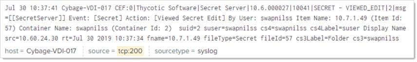

[title]: # (Using Splunk)
[tags]: # (configuration)
[priority]: # (104)
# Using Splunk

## Overview

You can easily correlate Secret Server syslog data using Splunk’s field-extraction
capabilities. Secret Server’s detailed Syslog currently contains 44 different events,
tracking more than 20 unique data fields.

## Example: Tracking Frequent Use

You could create a `full_suser` custom extraction field that extracts fields
that have a space in the reported data, a user’s full name in this case. By
default, Splunk identifies SS users by their User ID, as stored in the database,
which is represented as their user number.

   

You could create a count-based table using the `full_suser` field extraction.
Put the following term into the search field in Splunk where `<instance>` is the
Secret Server syslog-specific data:

~~~~~~~~~~~~~~~~~~~~~~~~~~~~~~~~~~~~~~~~~~~~~~~~~~~~~~~~~~~~~~~~~~~~~~~~~~~~~~~~
source="<instance>" "SECRET - VIEW" stats count by suid,full_suser | table suid full_suser count | search count > 2
~~~~~~~~~~~~~~~~~~~~~~~~~~~~~~~~~~~~~~~~~~~~~~~~~~~~~~~~~~~~~~~~~~~~~~~~~~~~~~~~

### Secret Server Reported Events

The following table is a complete list of events in Secret Server’s syslog. Both `Event
Name` and  `Event ID` are contained in the log, as well as the data fields that
apply to the event.

#### Secret Server Data Fields

**Table: Secret Server Data Fields**

| Event Name                            | Event Id |
|---------------------------------------|----------|
| System Log                            | 500      |
| USER - CREATE                         | 1        |
| USER - DISABLE                        | 2        |
| USER - ENABLE                         | 3        |
| USER - LOCKOUT                        | 4        |
| USER - ADDEDTOGROUP                   | 5        |
| USER - REMOVEDFROMGROUP               | 6        |
| FOLDER - CREATE                       | 7        |
| FOLDER - DELETE                       | 8        |
| ROLE - CREATE                         | 9        |
| ROLE - ASSIGNUSERORGROUP              | 10       |
| ROLE - UNASSIGNEDUSERORGROUP          | 11       |
| ROLEPERMISSION - ADDEDTOROLE          | 12       |
| ROLEPERMISSION - REMOVEDFROMROLE      | 13       |
| FOLDER - EDITPERMISSIONS              | 14       |
| CONFIGURATION - EDIT                  | 15       |
| USER - LOGIN                          | 16       |
| USER - LOGOUT                         | 17       |
| USER - LOGINFA LURE                   | 18       |
| USER - PASSWORDCHANGE                 | 19       |
| SECRET - CREATE                       | 10001    |
| SECRET - DELETE                       | 10002    |
| SECRET - UNDELETE                     | 10003    |
| SECRET - VIEW                         | 10004    |
| SECRET - EDIT                         | 10005    |
| SECRET - LAUNCH                       | 10006    |
| SECRET - HEARTBEATFALURE              | 10007    |
| SECRET - DERENCENCYFAILURE            | 10008    |
| SECRET - EXPIREDTODAY                 | 10009    |
| SECRET - EXPIRES1DAY                  | 10010    |
| SECRET - EXPIRES7DAYS                 | 10011    |
| SECRET - EXPIRES15DAYS                | 10012    |
| SECRET - EXPIRESS3DAYS                | 10013    |
| UNLIMITEDADMIN - ENABLE               | 10014    |
| UNILIMITEDADMIN - DISABLE             | 10015    |
| EXPORTSECRETS - EXPORTED              | 10016    |
| IMPORTSECRETS - IMPORTED              | 10017    |
| USERAUDIT - EXPIRENOW                 | 10018    |
| SECRET - SESSION RECORDING VIEW       | 10019    |
| SECRET - COPY                         | 10020    |
| SECRETEMPLATE - CREATE                | 10021    |
| SECRETTEMPLATE - EDIT                 | 10022    |
| SECRETTEWPLATE - TEMPLATE COPIED FROM | 10023    |
| LICENSES - EXPIRES300DAYS             | 10024    |

The following table is a complete list of data fields in Secret Server’s Syslog.
Only Data Fields relevant to the Event ID are included in the log.

>   **Note:** Some log entries may differ by field content. See the examples
>   below.

#### Secret Server Event Definitions

**Table 2: Event Definition**

| Data Field | Event Definition                    |
|------------|-------------------------------------|
| cs1        | Name of role modified               |
| cs1label   | "Role"                              |
| cs2        | Name of user or group added to role |
| Cs2label   | "Group" or "User"                   |
| CS3        | Name of folder containing secret    |
| cs3 label  | "Folder"                            |
| duid       | User ID being viewed or charged     |
| duscr      | Username being viewed outdated      |
| file ID    | ID of item action was taken on      |
| fileType   | Type of item action was taken on    |
| fname      | Name of item action was taken on    |
| Message    | Description of audit action         |
| msg        | Description of audit action         |
| Name       | Human-readable name of event        |
| Priority   | Event priority                      |
| Product    | Product name                        |
| rt         | Event time                          |
| src        | IP Address of client machine        |
| suid       | User ID of user performing action   |
| suser      | Username of user performing action  |
| Vendor     | Name of company                     |
| Version    | Secret Server version               |

In this event, the Administrator account in SS has edited the secret:

   