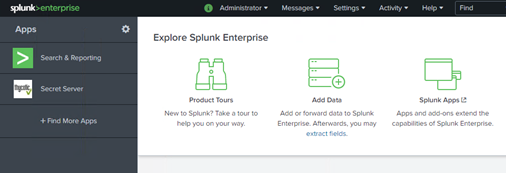
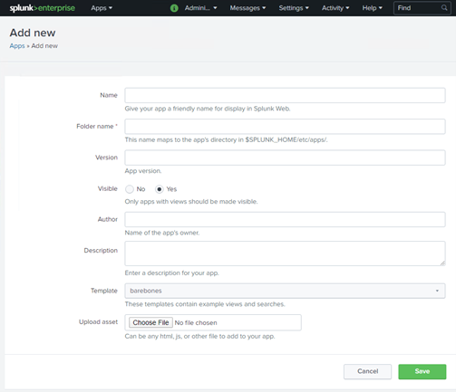
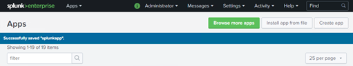
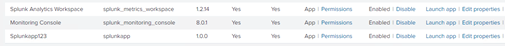
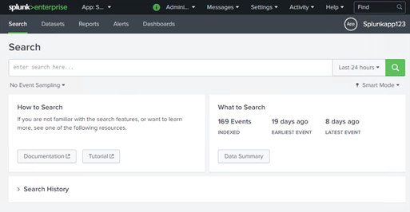
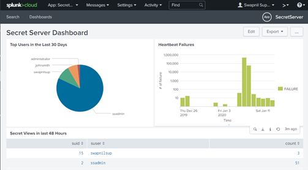
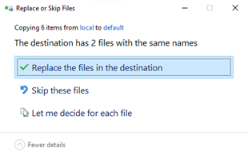
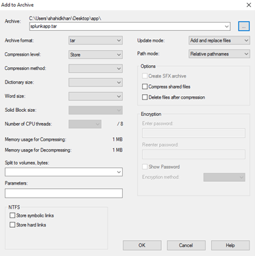
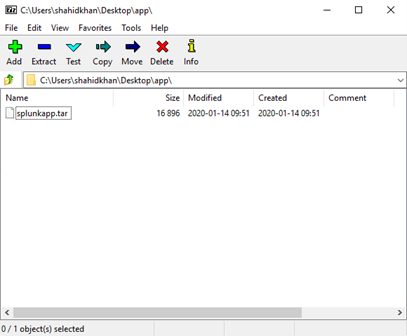

[title]: # (Publishing and Packaging the Splunk App)
[tags]: # (splunk app)
[priority]: # (107)
# Publishing and Packaging the Splunk App

The Splunk app is a quick way to get analysis, reports, health checks, and usage of your on-premises Secret Server instance.The App is created on the enterprise edition of Splunk so that it can be packaged and published on the Splunkbase.

## Publishing and Packaging Splunk App to Splunkbase

To create a Splunk App, ensure that the prerequisites are met.
This section provides the steps to create an app, create dashboard, and package the app.

The following are the steps to be performed:

   * Create an App
   * Create Dashboard
   * Package the App

## Prerequisites

The following are the prerequisites to create the Splunk App:

   * You need to have an account on Splunk to download and install Splunk Enterprise.
   * You need to have Splunk Enterprise edition installed on your computer.

## Step one: Creating an App

The first step is to fill in information in the Add new page to create an App.

1. Navigate to Splunk Enterprise.

   

   >**Note:** After installing Splunk enterprise edition, you can navigate to the enterprise by entering the URL https://localhost:8000.

1. On the left-hand side, click the __Manage Apps__ icon.

   
1. On the upper-right click __Create app__.

   
1. In the __Add new__ page, fill in the information:

   
1. Select the default template.
1. Click __Save__.

   
1. On the upper-left, a message, __Successfully saved “splunkapp”.__ will appear.
1. The Splunk app is saved. You can check the new app at the following location on your computer where enterprise edition is installed: `C:\Program Files\Splunk\etc\apps`.

## Step Two: Creating the Dashboard

The second step is to fill in the Create a New Dashboard dialog box and add source code to create a new dashboard.

1. Navigate to the __Apps page__.
1. Click __Launch app__ in the Actions column of the app you created.
1. The Search page appears.

   
1. Click the __Dashboard__ menu.

   
1. Click __Create New Dashboard__.

   
1. In the __Title__ text box, enter the title for the dashboard.
1. In the __Permissions__ field, select __Shared in App__.
1. Click __Create Dashboard__.

   
1. In the Edit Dashboard area, click __Source__.

   
1. Copy the entire code from the [XML reference](scripts/secret_server_dashboard.xml). This is the source code to create a new dashboard and paste in the code editor.
1. On the upper-right, click __Save__.

   

## Step Three: Packaging the App

Packaging is the final step before uploading your app to Splunkbase. For this, you take your App directory and compress it into a single file that can be uploaded to Splunkbase.

Splunkbase uploads are required to have the `.spl` file extension. For example: `myapp.spl`. SPLformat is identical to `.tar.gzformat`. The only difference is the file extension.

Make sure you have placed all the app components in the correct location, have moved all customizations from `\local` to `\default`, and have tested your app before you package it.

__To move all customizations from “\local” to “\default":__

1. Go to `C:\Program Files\Splunk\etc\apps\splunkapp\local`.

   
1. Copy the data folder.
1. Go to `C:\Program Files\Splunk\etc\apps\splunkapp\default`.

   
1. Paste the data folder. The Replace or SkipFiles dialog box appears.

   
1. Click __Replace__ the file in the destination.

__To package the app to TAR using 7-Zip:__

1. Install 7-Zip from http://www.7-zip.org/.
1. Open 7-Zip.

   
1. On 7-Zip file explorer, navigate to the parent directory of your app (for example: `C:\Program Files\Splunk\etc\apps`).

   
1. Click the __Add__ icon.

   
1. Select the __Archive__ format as tar.
1. Click the __ellipsis__ icon to choose the location where you want to save the TAR file.

   
1. Click __Open__.

   
1. Click __OK__.

__To package the app to GZIP using 7-Zip:__

1. Open 7-Zip.
1. On 7-Zip file explorer, navigate to the location where you have saved the TAR file.

   
1. Select the file.
1. Select the __Archive__ format as gzip.

   
1. Click __OK__.
1. The App is packaged, and you can now upload the App to your Splunkbase.

## References

This section includes the following:

   * Syslog Events: Click [here](syslog_events.md) for the following file has the sample data of the available syslog entries.
