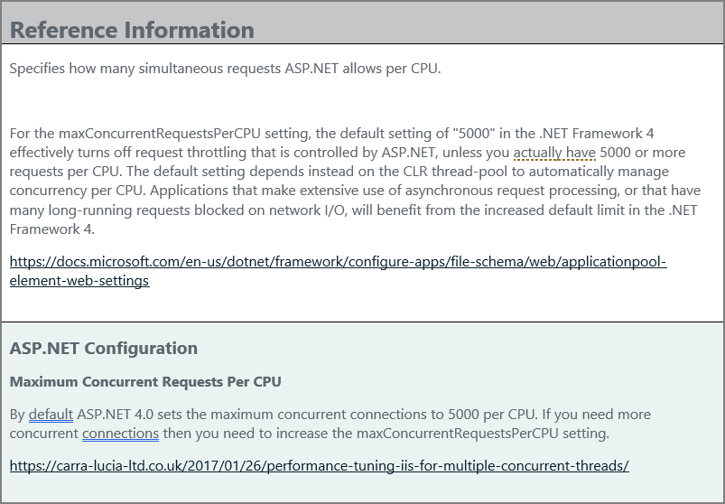
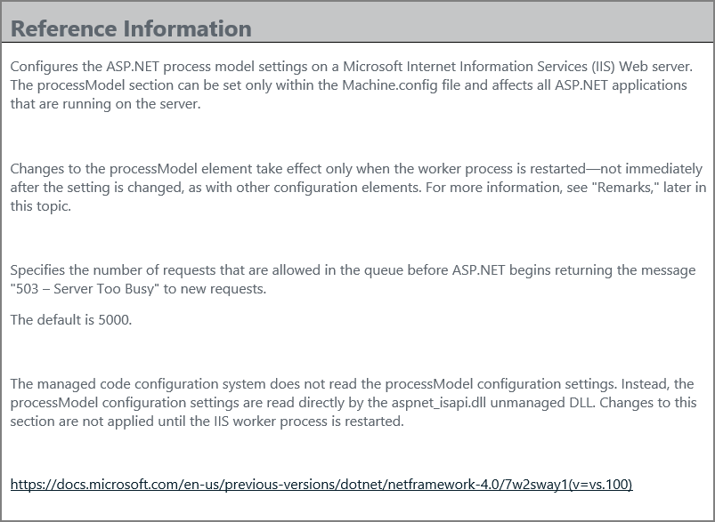

[title]: # (Additional information)
[tags]: # (tuning)
[priority]: # (4)
# Additional information

__maxConcurrentRequestsPerCPU__

The property is defined in

`C:\Windows\Microsoft.NET\Framework64\v4.0.30319\Aspnet.config
<system.web>
  <applicationPool maxConcurrentRequestsPerCPU="5000"
</system.web>"`

__requestQueueLimit__

The property is defined in  

`C:\Windows\Microsoft.NET\Framework64\v4.0.30319\Config\machine.config
<system.web>
  <processModel requestQueueLimit="5000" />
</system.web>`

