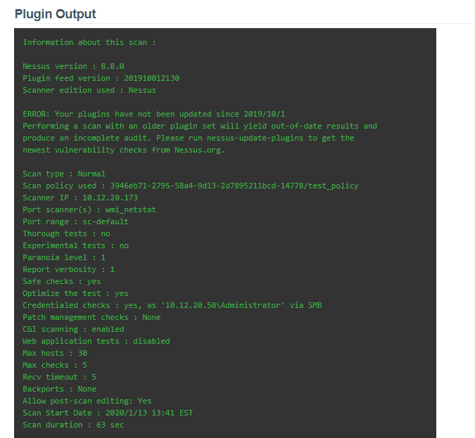
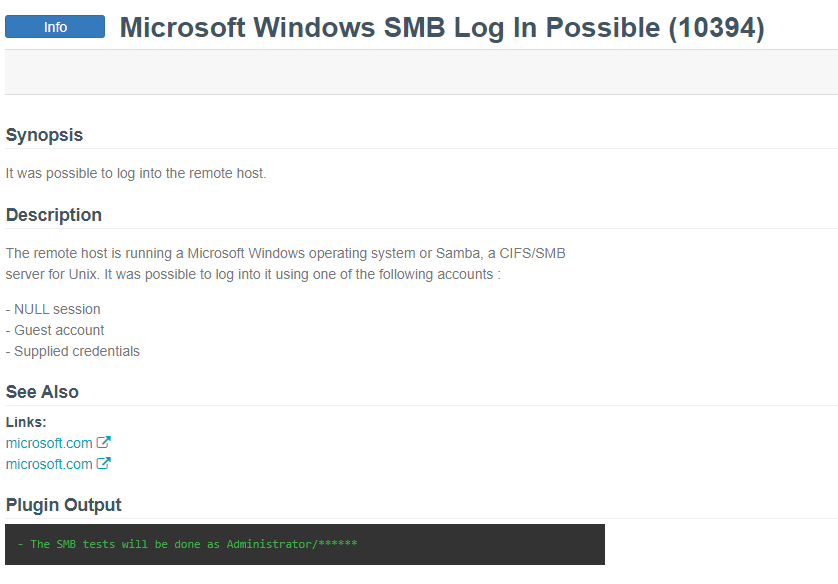
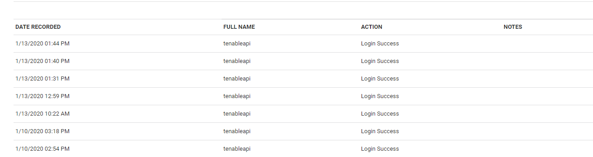

[title]: # (Troubleshooting)
[tags]: # (introduction)
[priority]: # (500)
# Troubleshooting

## Verifying Integration

There are a few ways you can verify integration as working. One of the easiest way’s we have found to verify the integration is to either create a policy with a __Basic Network Scan__ or create an __Advanced Scan__ that contains plugins: 19506 (Windows or Linux hosts), 10394 (Windows hosts), 12634 (Linux Hosts), or 21745 (Windows or Linux hosts).

Below is an example screenshot of a scan with the 19506 plugin configured and another scan result with plugin 10394 configured and ran, respectively

   

   

You can also verify the integration is working by checking Secret Server. Click on __Admin | Users__ and locate your application API account used for the integration. Click on the individual user account and choose the __View Audit__ button. You should see successful logins that correlate to when you have run an active scan from within Tenable.

   
