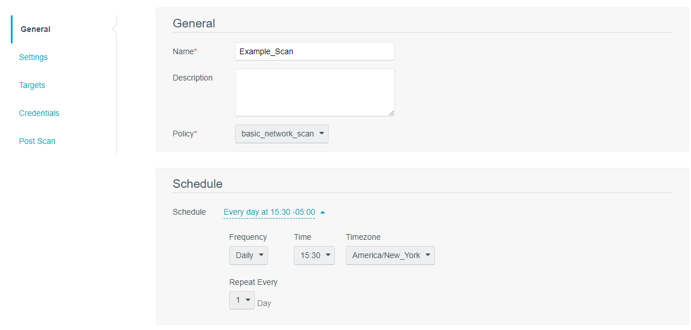
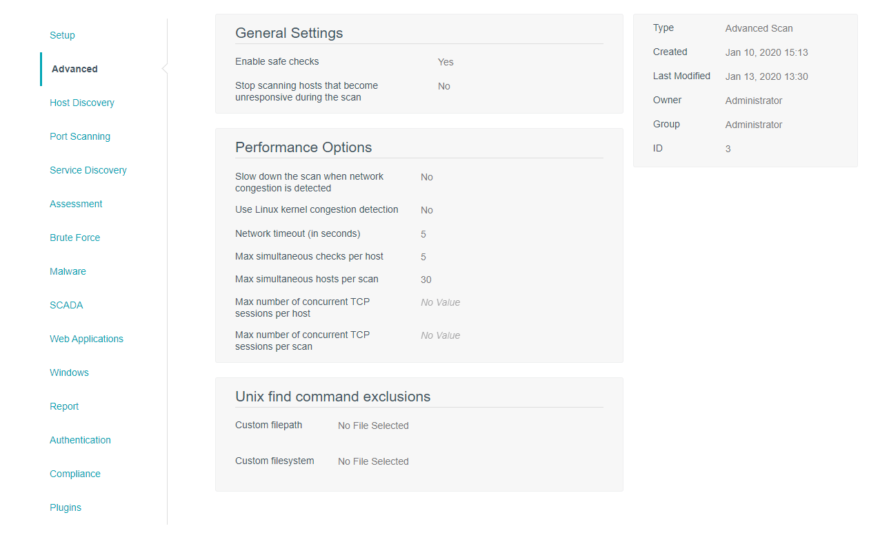
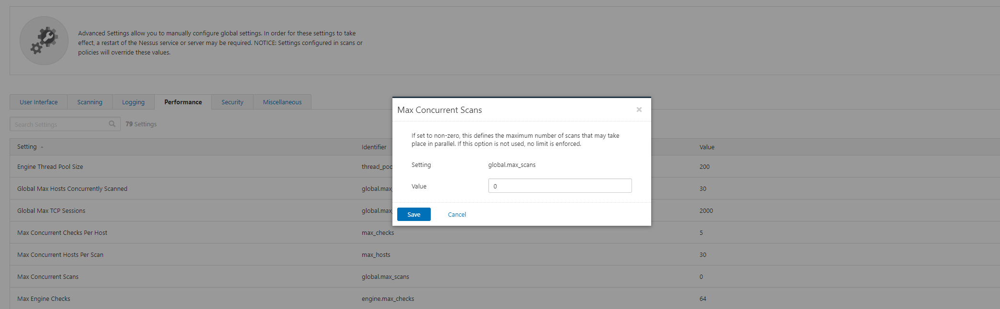

[title]: # (Performance)
[tags]: # (performance)
[priority]: # (501)
# Performance

## Decrease the number of concurrent systems in the Active Scan

If you observe performance related issues within Secret Server because of the number of credentials being retrieved through the integration, one option to consider may be to create several Active Scans that encompass separate hosts/targets and is scheduled to run at different times. This can help decrease the number of concurrent API requests that may occur when running the scan. One idea to mitigate performance concerns with many hosts may be to create different Active Scans based on subnets or device types. One example may include having one Active Scan compromising Linux hosts and another Active Scan compromising of Windows hosts that runs its scans at different times.  To take this a step further, you could separate this by network segments. Separate Scan Zones may help with this idea.

   
## Decrease the values for Scan specific settings

When using the Integration, we recommend configuring policies that utilize the “Advanced Scan” option. Using this type of policy allows you to make Advanced adjustments that allow you to tune Performance related options for the scan that can help decrease the number of simultaneous calls to Secret Server.

The default value of “30” for Max simultaneous hosts per scan combined with a max simultaneous of “5” checks per host indicates that there can be up to 450 API calls occurring per scan at any given time. If this is combined with multiple scans occurring at the same time, the number of these simultaneous API calls could produce performance issues. For large tenable environments, we recommend adjusting this to a smaller value, such as 15 Max simultaneous hosts per scan and “3” Max simultaneous checks per host.

   
To ensure that your scanners are not performing several credentialed related scans at once, you can also adjust the Nessus scanner settings themselves manually. Consider configuring global.max_scans settings to a value other than 0 to limit how many simultaneous scans can occur at once. This will further limit the potential number of simultaneous API calls to Secret Server.

## Dedicated Web Server API Nodes

For many endpoints (large enterprises), and if you have other API use cases as part of your Secret Server environment, consider having dedicated Web Servers for API use cases in addition to the IIS tuning settings described previously. Please note that this may only be directly controlled by On Premise Secret Server customers. This may comprise of one or more web servers that have their own unique URL and have Secret Server roles such as the background worker, engine worker, and session recording worker roles disabled. This will ensure that any performance impact that occurs does not affect other operations within the application.
