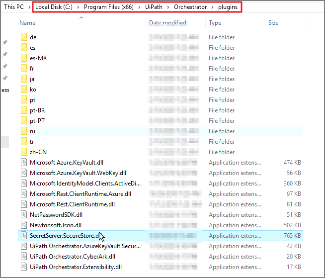
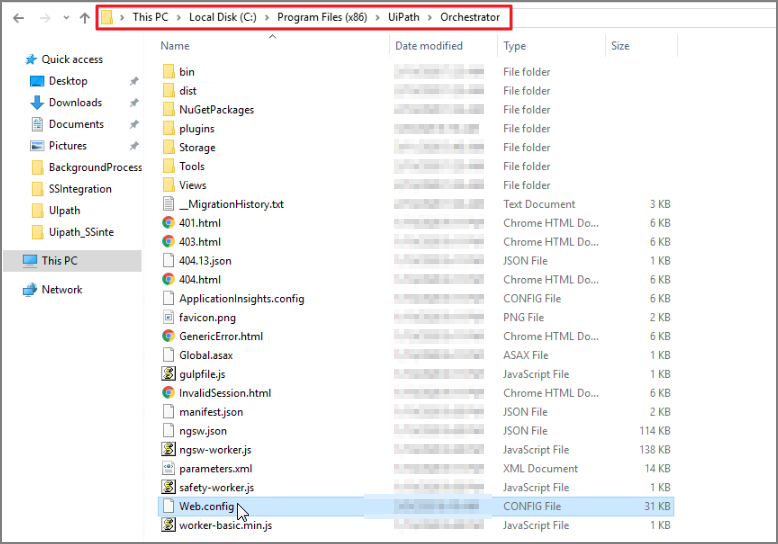
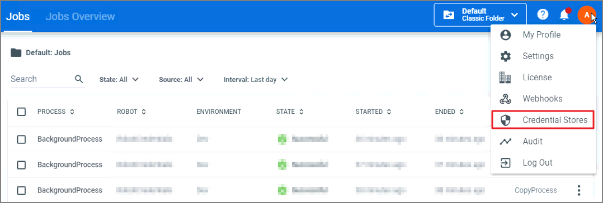
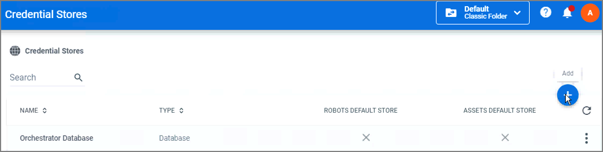

[title]: # (Create a Credential Store in UiPath Orchestrator)
[tags]: # (credential store)
[priority]: # (202)
# Create a Credential Store in UiPath Orchestrator

1. Copy the SecretServer.SecureStore.dll file into the following directory: `C:/program files(x86)/UiPath/Orchestrator/plugins`

   

1. Open the web.config file under the following path: `C:/programfiles(x86)/UiPath/Orchestrator` by right-clicking the file and selecting __run as administrator__.

1. Modify the web.config file to reflect the Secret Server dll value:

   _<add Key="Plugins.SecureStores" value=SecretServer.SecureStore.dll">_

   

   
1. Log in to your UiPath Orchestrator account as the Administrator.

   
1. In the right-hand corner of the screen, click on your account icon and click Credential Stores.

   
1. Click the __Add__ icon.

   
1. Select __SecretServer__ under the Type dropdown selection.
1. Click __Create__.

   

   >**Note:** You will need to re-visit the credential store steps, after setting up an onboarding rule in SKD Management and creating an onboarding key in Secret Server. [Setup a New Onboarding Rule in SDK Management](setup-onboarding-rule-sdk.md)