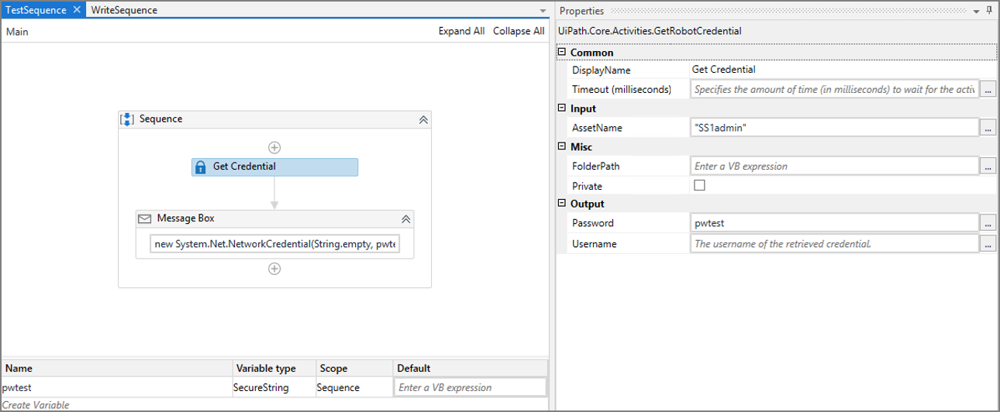

[title]: # (Create a Process)
[tags]: # (configuration)
[priority]: # (208)
# Create a Process in UiPath Studio 

The most important activity for integrating with Secret Server is __Get Credential__. With this activity, the robot will request a password from Secret Server and save it as a variable to be used later.

   

1. Naviagte to __UiPath Studio__.

1. After adding __Get Credential__ to a sequence, you will need to  supply some further information:

* __DisplayName__: By default this activity will be named “Get Credential,” but this can be customized

* __Timeout__: This number may need to be raised if the activity is timing out before successfully pulling the password

* __AssetName__: The bot does not care which Credential Store the password is coming from – it looks this information up the Asset by name, and must be entered in quotes

* __Password__: Once retrieved, the credential must be saved to a variable.  Enter a variable name here (no quotes necessary)

Next, you will need to create a variable.

1. Click the __Variable tab__.

   

1. Give the variable the same name you chose for the Output of the __Get Credential__ action.

1. Change the __variable type__ to SecureString.
1. Select __Browse for Types__ and search for __SecureString__.

## Test the connection with Secret Server

Now that Get Credential is pulling a password from Secret Server and saving it as a SecureString variable, we can use it in another Activity. A good test whether the connection with Secret Server is working is a message box popup.

1. Click the __(+)__ icon below Get Credential to add a new activity.

1. Click __Message Box__.

   

1. The only important field here is __Text__ where we will instruct the message box to display our newly saved variable:

   `new System.Net.NetworkCredential(String.empty, pwtest).Password`

1. Once the Message Box action is configured, we can test the Secret Server connectivity by clicking on __Run File__.

   

1. A box should appear with the password value from Secret Server.

   

## Test the Get Credential Action

Now that we know the integration is functioning, the next test is whether or not the robot can correctly carry out a Get Credential action unattended.  For the second example, we will use the same Get Credential activity but pair it with the “Append Line” activity.

   >**Note:** If this is a new Sequence, a new SecureString variable will need to be created.

1. To configure the Append Line activity, you will need the following information:

   * The file you want to append a line to, for example a notepad file that was previously created.

   * The text you want to append. A time and date stamp is helpful to make sure that the robot wrote to the text file at the correct time, so this text is a useful test:

   __DateTime.Now.ToString() + " " + new System.Net.NetworkCredential(string.empty, notepadPass).Password__

   

1. Click __Run File__.
1. UiPath Studio will pause for a moment and reopen.  
1. Check the text file to ensure that the change was made.

   