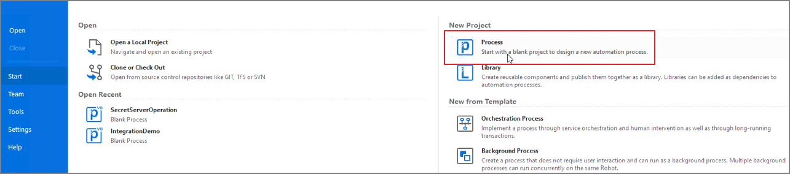
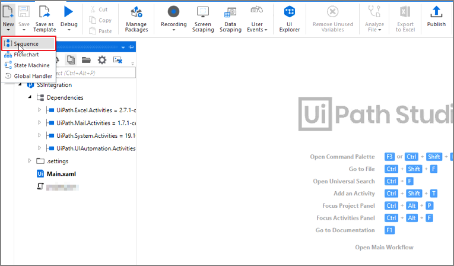
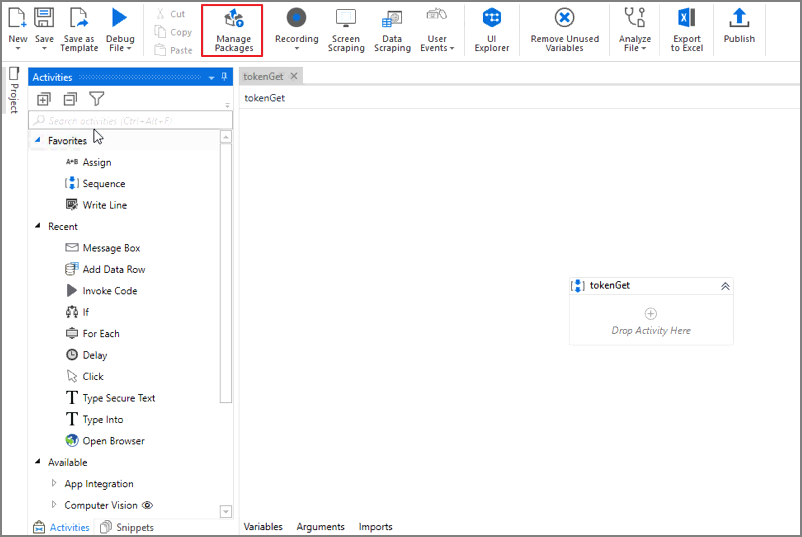
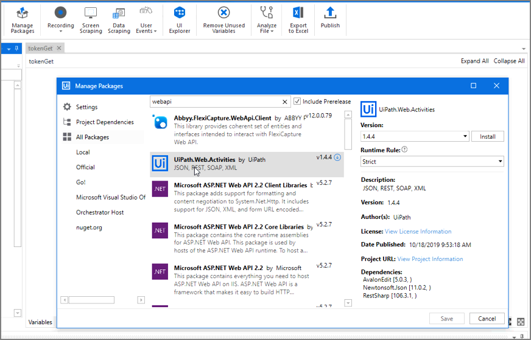
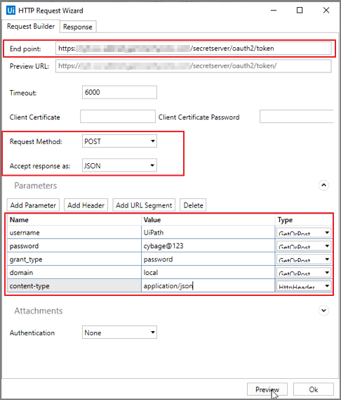
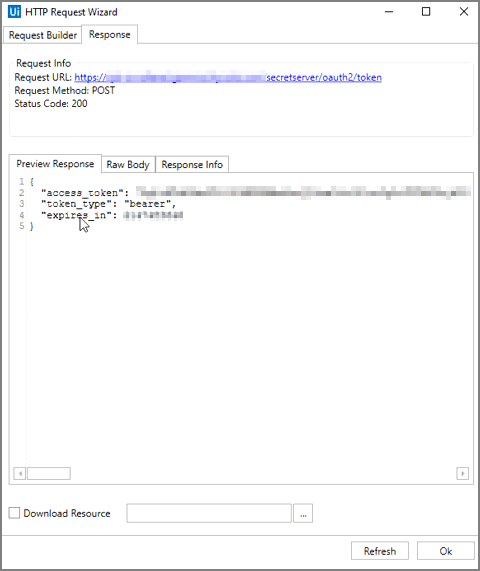

[title]: # (Create a Token)
[tags]: # (token)
[priority]: # (202)
[display]: # (none)
# How to Create a Token

## Create a new Project

<!-- add information on how to verify that the integration works -->

1. Open UiPath Studio console.

   
1. Click __Process__ to start a new project.

   
1. Enter in a name and description for the project.
1. Click __Create__.

   
1. Click on the __Project__ folder.
1. Click on __New__ and __sequence__.

   
1. Name the new sequence and click __Create__.

   
1. The following screen will appear.

   

## How to Create a Token

1. Click on __Manage Packages__.

   
1. Select __All Packages__.
1. Search for __webapi__.
1. Click on __UiPath.Web.Activities__.

   
1. Click __Install__ and __Save__.
1. Search for _HTTP Request__ in the project console.

   
1. Drag and drop the _HTTP Request__ to the sequence name (Example: tokenGet).

   
1. In the __HTTP Request Wizard__:

   * Enter in the End point for Secret Server.
   * Change the Request Method to __POST__.
   * Change the Accept response as to __JSON__.

1. Click on __Add Parameter__ and add the following parameters shown in the image below.

1. Click on __Add Header__:

   * Enter in __content-type__ for Name.
   * Enter in __application/json__ for Value.

   
1. Click __Preview__.
1. Under the __Response__ tab in the HTTP Request Wizard, you should be able to see the new token.

   
