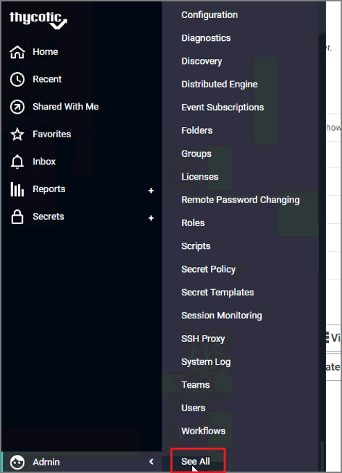
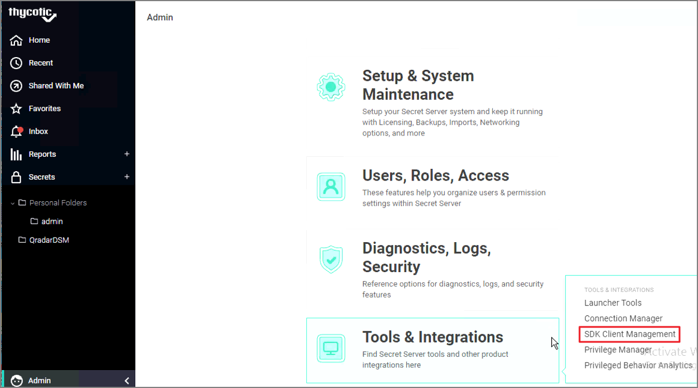
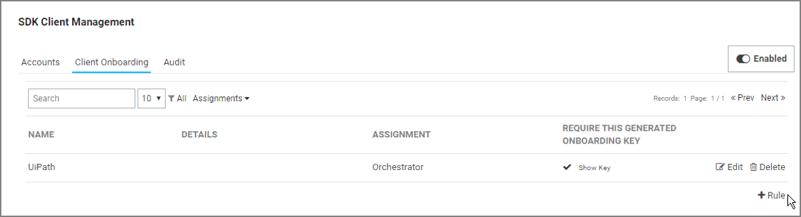
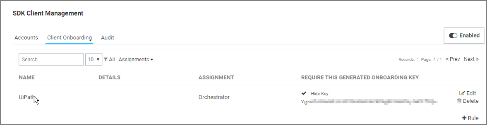
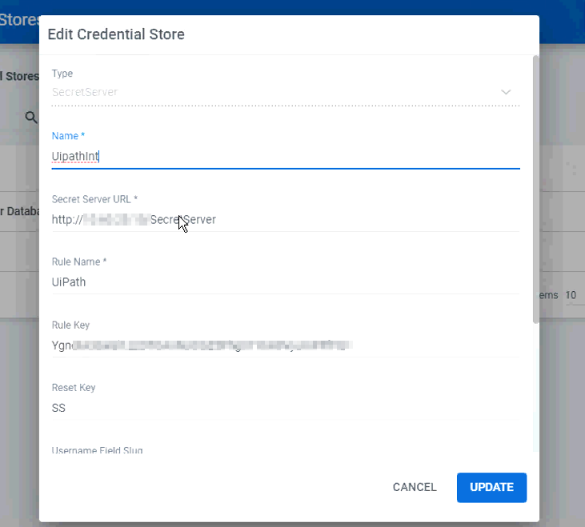

[title]: # ( Setup a New Onboarding Rule in SDK Management)
[tags]: # (configuration, onboarding rule)
[priority]: # (204)
# Setup a New Onboarding Rule in SDK Management

   >**Note:** You will need to re-visit the credential store steps after setting up an onboarding rule in SKD Management and creating an onboarding key. [Create a Credential Store in UiPath Orchestrator](create-credential-store-uipath.md)

1. Navigate to __Admin | See All__.

   
1. Click on __Tools & Integrations | SDK Client Management__.

   
1. Click on the __Client Onboarding__ tab.

   
1. Click the __+Rule__ option.

   
1. Enter a name for the new rule.
1. After clicking Save, it will auto-generate an onboarding key. You can see the key by selecting the __show key__ option.

   
1. Navigate back to your __UiPath Orchestrator account | Credential Stores__.
1. Click on the __More Actions icon__ to the right of the Secret Server credential store.
1. Click __Edit__.

   
1. Provide the following information:
   * __Secret Server Url__
   * __Rule name__ (Step 5)
   * __Onboarding key__ (Step 6).

1. Click __Create__ or __Update__.

   
