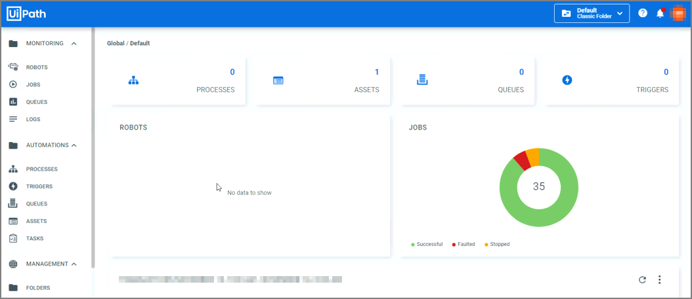
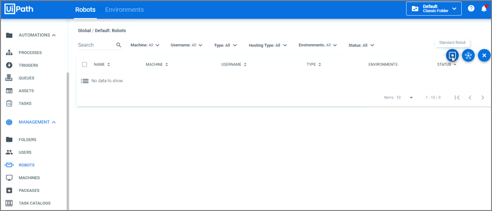
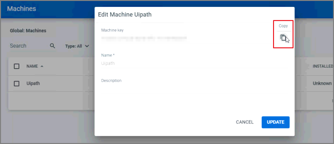
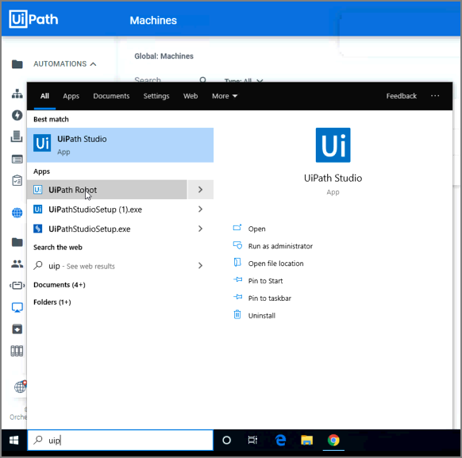
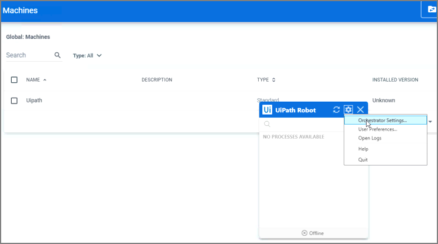
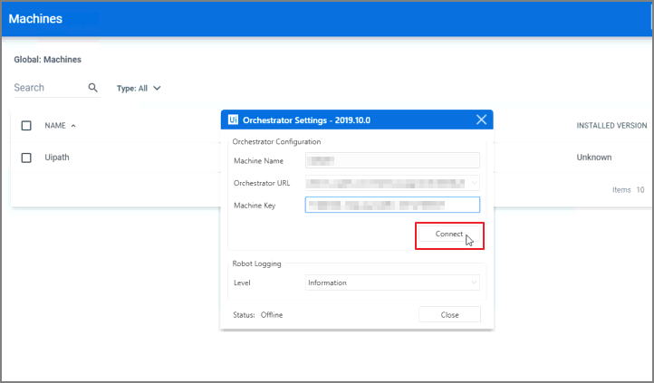

[title]: # (Install and Configure UiPath)
[tags]: # (uipath)
[priority]: # (201)
[display]: # (none)
# Install and Configure UiPath

<!-- add troubleshooting topic and info -->

1. Navigate to your UiPath account you, you will be able to see the Monitoring Console screen.

   >**Note:** You will first need robots deployed for the integration to work.

   
1. Under __Management__ click on __Robots__.
1. On the next screen, click the __+__ sign.

   
1. Click on the sign for __Standard Robot__.

   
   * Enter in the __Host Name__ under __Machine__.
   * Select Type and click on __Studio__.
   * Enter in a Name and Description.
   * Enter in Domain\Username for the host you’re currently using.
   * Enter your Domain Password.
1. Click on __Create__.

   
1. Under the __Management__ Tab, click on __Machines__.
1. Click on the __More Actions__ button.

   
1. Click on __Edit__.

   
1. Copy the __Machine Key__ and click  __Cancel__.

   
1. Navigate to the Search option in Windows and look for __UiPath Robot__.

   
1. Click on UiPath Robot and select the Gear button for Settings.
1. Click on __Orchestrator Settings__.

   
   * __Machine Name__: This should prepopulate the host name.
   * __Orchestrator URL__: Copy and past the URL from your UiPath profile (Example: Https://platform.uipath.com/<accountname>/Default).
   * __Machine Key__: Copy and paste the Machine name from __step 15__.
1. Click on __Connect__.

   
1. The __Status Message__ at the bottom of the settings screen should now show : __Status: Connected, Licensed__.

   
1. Click __Close__.
1. Under the __Management__ Tab, click on __Robots__, there should be a green check mark displayed by the robot that was just created.
1. Under the __Management__ Tab, click on __Machines__, you will be able to view the installed version.
