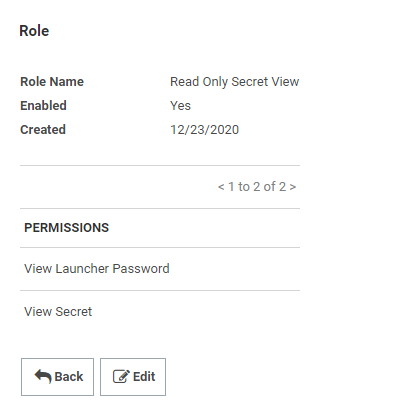

[title]: # (Best Practices)
[tags]: # (best practices)
[priority]: # (208)
# Best Practices

The API User Account does not explicitly need the “User” role as indicated in our basic setup instructions. We would recommend pursuing a least privilege model. Ensure that your API account has “View” access to the secrets you intend to integrate with. You can then lock down that API account with a custom role that has the following permissions. This has been verified and tested against the 20.x release of Orchestrator/Studio/Robot.

   

   * If you do intend to use a Secret for multiple purposes, such as
    incorporating password changes in addition to workflow features *and* it
    will also be leveraged by a Robot, please be mindful that the integration
    matches based on SecretID. Focus on Secret Server specific use cases related
    to the account first and then integrate with UiPath afterwards. Since it
    simply is retrieving the password based on SecretID, other fields can be set
    to your requirements. It is important to note that the integration does not
    currently work with the “Checkout” feature.

   * Lock down each Secret that is intended to be used for the integration. If
    possible, leverage dedicated accounts in Secret Server for Robot purposes
    that only the API account and possibly an Owner of the account in Secret
    Server has access to. If multiple people have access to the account, without
    the “Checkout” feature being supported, it may be difficult to determine
    attribution if multiple people were to access the Secret at the same time.

   * For the Secret that is used to run Robot jobs when configuring the
    Unattended Robot, we recommend that you configure that secret for regular
    password changing. Please reference your internal policy for how often
    privileged service account passwords should be changed.

   * We would never recommend appending any kind of file with a function in
    Studio that puts a plaintext password into a text file for any purposes of
    production use. The examples shown in our Verifying integration section are
    simply to verify that the integration is working.
