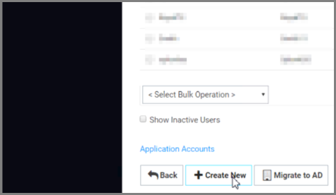
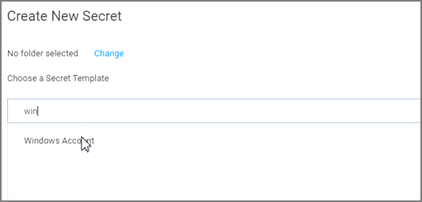
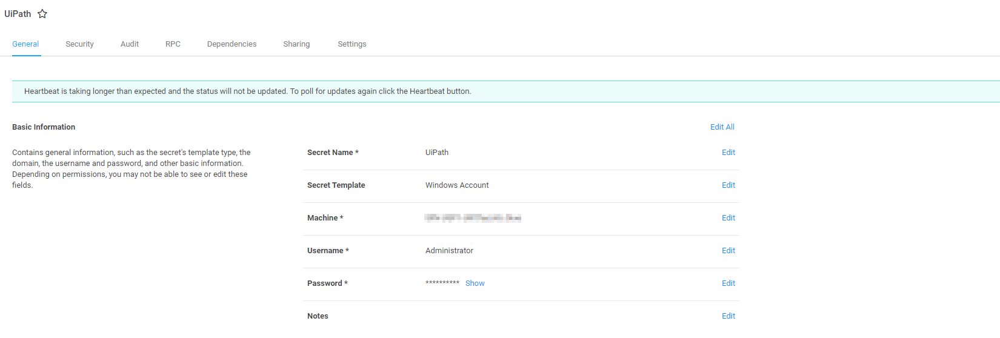

[title]: # (Configuration Steps for Secret Server)
[tags]: # (secret server)
[priority]: # (202)
# Configuration Steps for Secret Server

### Create an Application Account

1. Navigate to Secret Server and login.

   

1. Click Log in

1. Click __Admin | Users__.

   
1. Click the __Create New__ button at the bottom of the screen.

   
1. Enter in a __User Name, Email Address and Password__.

   
1. Click the __Advanced__ option.
1. Check the box for __Application Account__.
1. Click __Save__.

   >**Note:** Generally when the UIPath Application Account is a domain account, the AppPool should have "Load User Profile" set to true.

   
1. Click __Ok__ on the next screen to convert the user to an Application Account.

   
1. Click on __Assign Roles__.

   
1. Assign the __User__ role. (Please See our Best Practices Section if you would like to do Least Privilege)

1. Click __Save Changes__.

### Create a Secret for the UiPath Integration

1. Navigate back to __Home__ in Secret Server.

   

1. Click on __(+)__ icon next to __Secrets__.

   
1. Search for the __Windows Account__ template. Please be mindful that this is an example template we are using for these instructions. Any template may be used as long as a username and password is being referenced.

1. Click on __Windows Account__.

   
1. For the New Windows Account template, you will need to complete the following fields:

   * __Name__: Name of the Secret

   * __Machine__: This can be anything in theory as the integration does not
        match based on the Secret Machine value and reads from the password
        field based on the SecretID. If you are using the Secret for
        RPC/Heartbeat, etc, then have this match a valid machine name FQDN

   * __Username and Password__: The account username and password that you
        intend to integrate with a UiPath asset.

1. Click __Create Secret__.

   
1. Click on the __Sharing__ Tab, then __Edit.__

1. Under the Search area for __Add Groups/Users__, enter in your __UiPath application account__. The API account only requires “View” access to Secrets you intend to integrate with

1. Click __Save__.

   