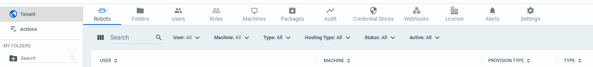
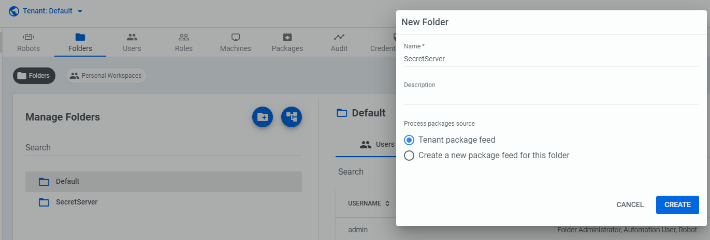
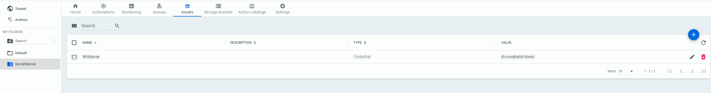
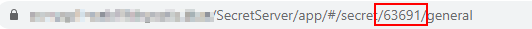
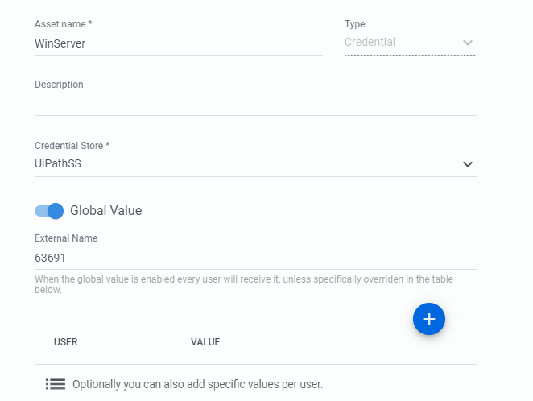
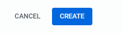

[title]: # (Create An Asset)
[tags]: # (asset)
[priority]: # (205)
# Create An Asset

Creating an asset is what unique ties a component of Orchestrator to a Secret within Secret Server. The asset name will later be referenced in Studio/your Robot and the External Name configured in the asset will match the SecretID you created in the previous steps.

1. Create a new Folder. You can do this by clicking the __Tenant__ button then clicking on __Folders__.

   
1. Click the __+__ button in the __Manage Folders__ submenu. You can name the folder appropriately and click __Create__.

   
1. Create an Asset within the folder. Click on the new folder you created which is now displayed on the left side menu then click __Assets__.

   

1. Click the __+__ button and create a new asset:

    * For the __Asset Name__ – this can be anything. We recommend calling it
        something that either matches your secret name value or can be
        recognized as being associated with that Secret.

    * For __Type__ – choose “Credential”

    * For __Credential Store –__ choose your Secret Server Credential Store

    * Checkmark the __Global Value__ flag and enter in the SecretID that is associated with the Secret you created earlier. The SecretID can be retrieved in the URL

   
1. Once all information is filled out, click __Create__ at the bottom.

   

   