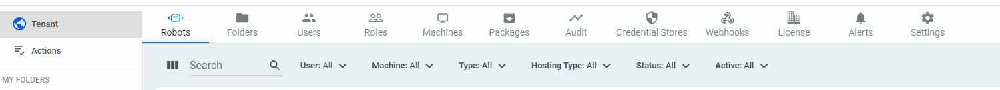
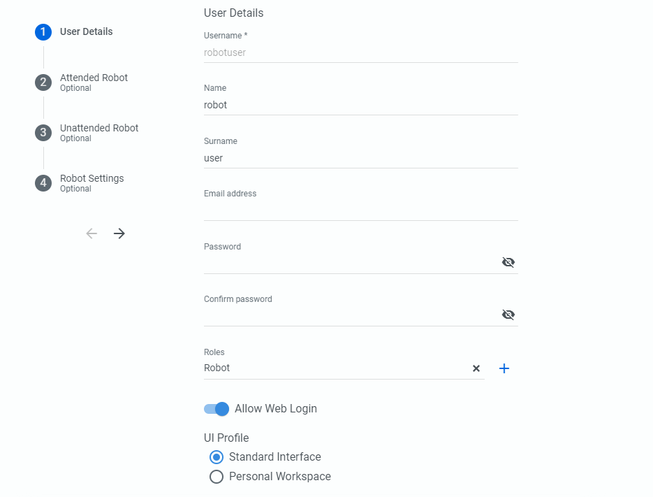
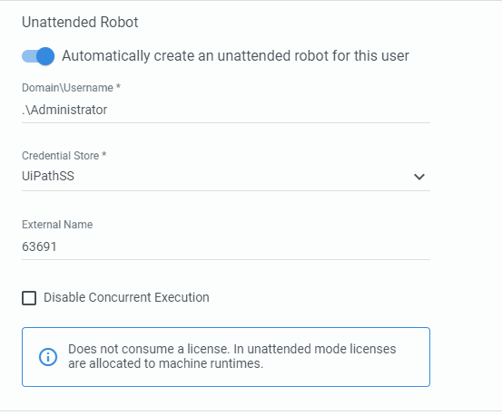
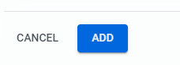
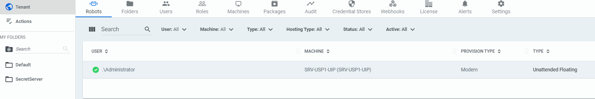
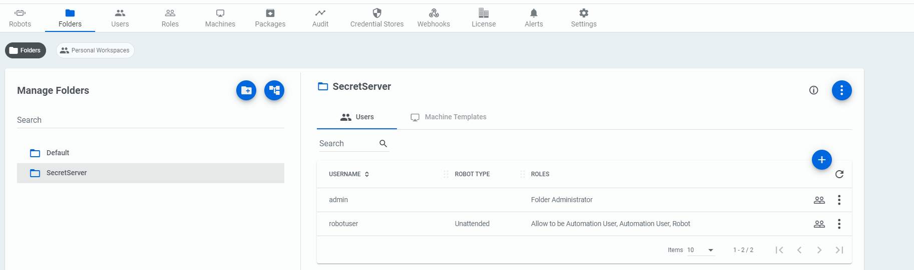

[title]: # (Create a Robot in UiPath Orchestrator)
[tags]: # (robot)
[priority]: # (206)
# Create a Robot in UiPath Orchestrator

Creating a Robot in version 20.x looks different compared to previous releases.

1. Click on the Tenant button and then click on __Users__.

   
1. When creating a user, fill out the corresponding information.

   
1. Depending on the type of Robot you are creating, you can choose Attended or Unattended option. For this integration, we choose the option for Unattended Robot.

   

   For the Domain\Username you must specify a domain and username format. To keep our example simple, we match the username provided in our Secret field and simply include “.\” to specify the local Administrator account. You could also specify machinefqdn\Administrator. We then specify the Credential Store and the SecretID again. Please note that these are the credentials that will be used to run the Robot jobs themselves. In our example we use the same SecretID to run robot jobs as the Secret that is associated to our Asset, but its possible that you may use one Secret for running jobs, while using another Secret for other automation tasks _within_ a job.

1. On the last tab, Robot Settings, there is no need to alter any settings here.

1. Click __Add__ to create the account and the Robot

   

1. You will then observe a Robot created.

   

1. Ensure that the new user you created has been provided permissions to the Folder you created earlier. This is done under the Folders menu. Click on your new folder and then click the __+__ button on the right.

1. Ensure that the new user you created has __Allow to be Automation User, Automation User, and Robot.__ These permissions may be able to be modified depending on what all your Robot may do.

   
