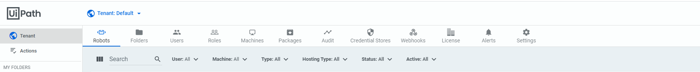
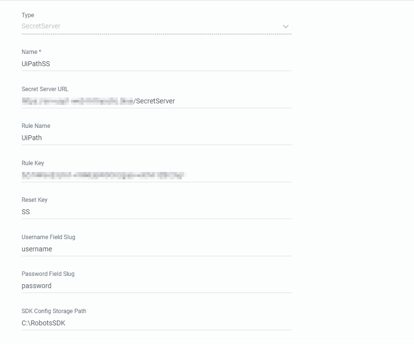

[title]: # (Create An Credential Store in UiPath Orchestrator)
[tags]: # (credential store)
[priority]: # (204)
# Create An Credential Store in UiPath Orchestrator

1. Log in to your UiPath Orchestrator account.

   

1. Once logged in to UiPath, click on the __Tenant__ button in the upper left part of the screen and then select __Credential Stores__.

   

1. Click the __+ (Plus)__ button on the right side of your screen to add a new credential store.

1. When creating the new credential store, provide the following information:

   * __Type__: Choose SecretServer from the drop down menu

   * __Name__: You can name this anything

   * __Secret Server Url__: This is your unique Secret Server URL

   * __Rule name__: This should match the Rule Name you have created in Secret Server

   * __Rule key__: This should will be the onboarding key generated in Secret Server

   * __Reset Key__: This can also be named anything

   * __Username Field Slug__: This should be “username”

   * __Password Field Slug__: This should be “password”

   * __SDK Config Storage Path__: This should be a path on your local Orchestrator server. Please note that the account running the IIS application pool for Orchestrator will need full access to this path.

   

1. Click __Create__ at the bottom of the screen.

   
