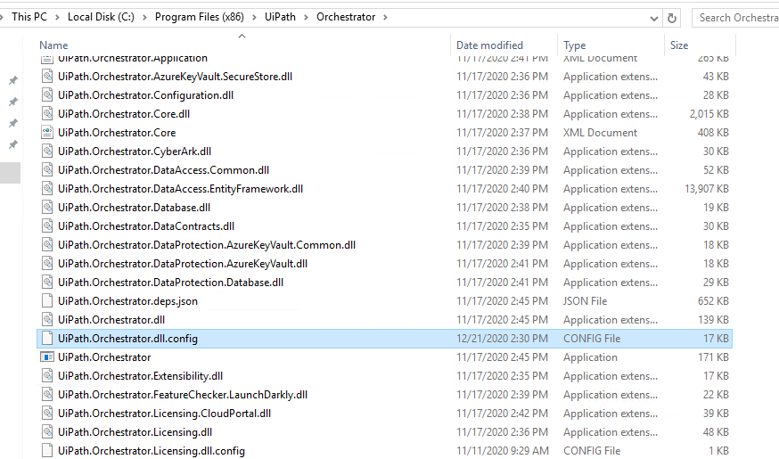
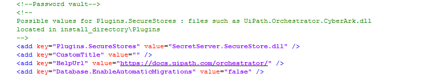

[title]: # (Prepare Orchestrator For Integration)
[tags]: # (orchestrator, integration)
[priority]: # (201)
# Prepare Orchestrator For Integration

1. Retrieve the latest published .dll for our integration which can be found at https://github.com/thycotic/uipath-orchestrator-tss/releases.

1. Copy the `SecretServer.SecureStore.dll` file into the following directory on your Orchestrator server.

   

1. Stop IIS on your Orchestrator Server. Open the __UiPath.Orchestrator.dll.config__ file with a text editor. We recommend opening your text editor first as an Administrator, then opening this file so that it can be modified. This file can be found in:

   `C:/programfiles(x86)/UiPath/Orchestrator`

1. Modify the __UiPath.Orchestrator.dll.config__ to reflect your Secret Server dll value:

   `\<add Key="Plugins.SecureStores" value=SecretServer.SecureStore.dll"\>`

   

   

1. After this is saved, Start IIS on your Orchestrator Server.
