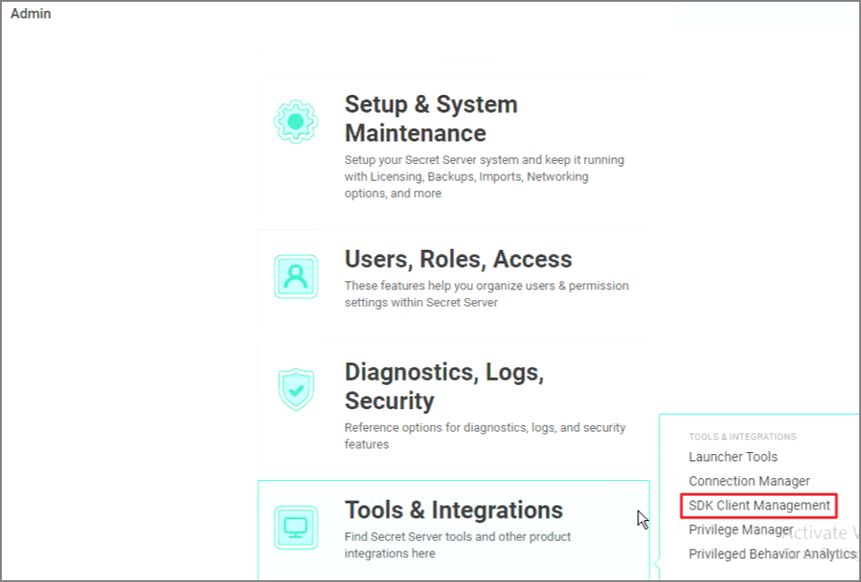

[title]: # (Setup a New Onboarding Rule in SDK Management)
[tags]: # (sdk management)
[priority]: # (203)
# Setup a New Onboarding Rule in SDK Management

1. Navigate to __Admin | See All__.

   
1. Click on __Tools & Integrations | SDK Client Management__.

   
1. Click on the __Client Onboarding__ tab.

   
1. Click the __+Rule__ option.

   

1. Enter a name for the new rule.

1. After clicking Save, it will auto-generate an onboarding key. You can see the key by selecting the __show key__ option.

   
