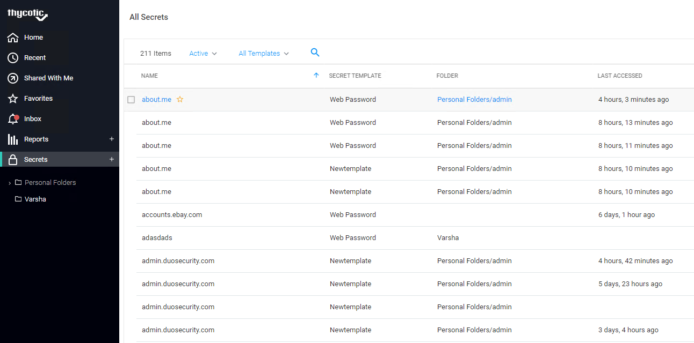
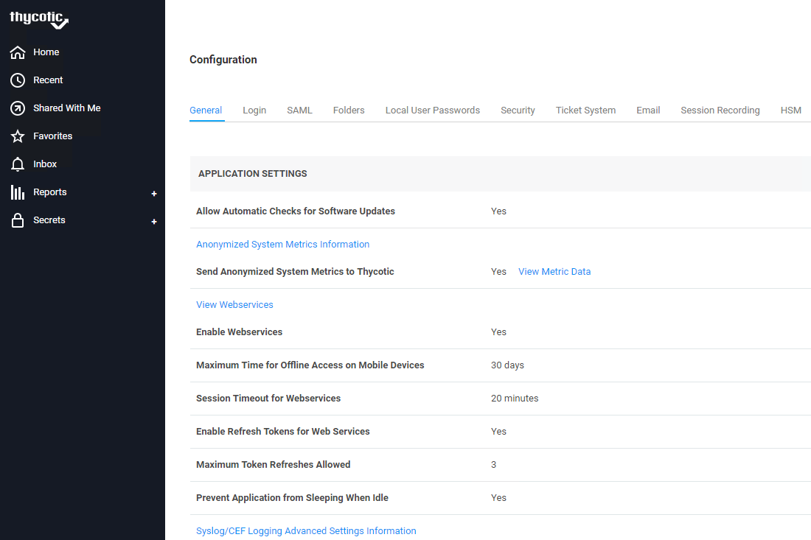
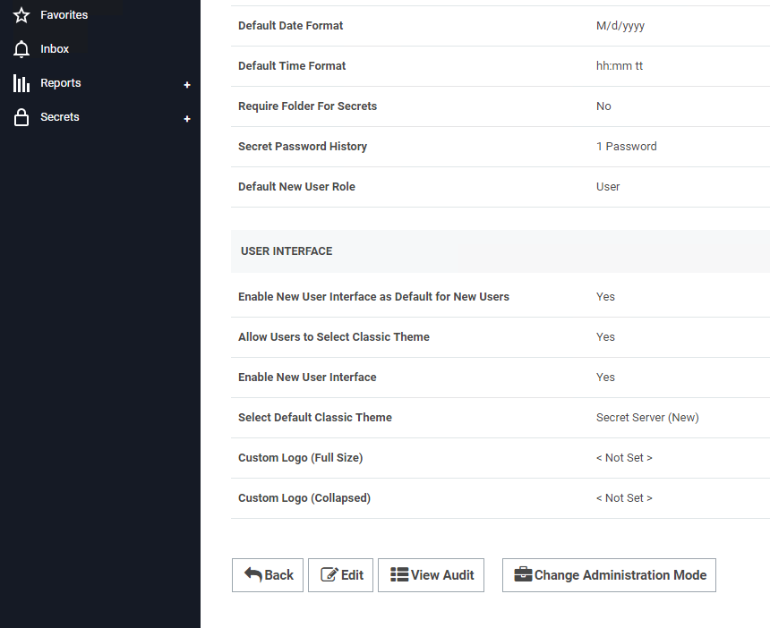
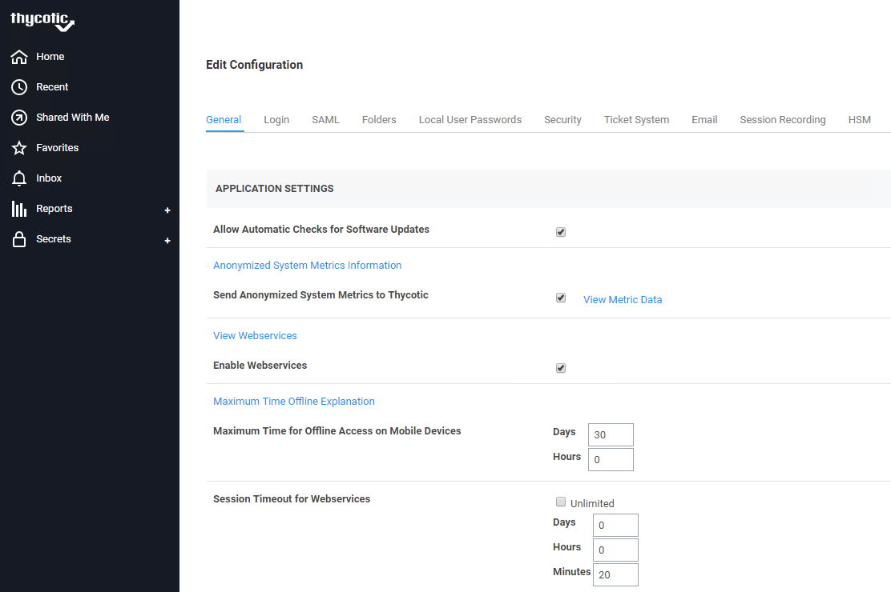
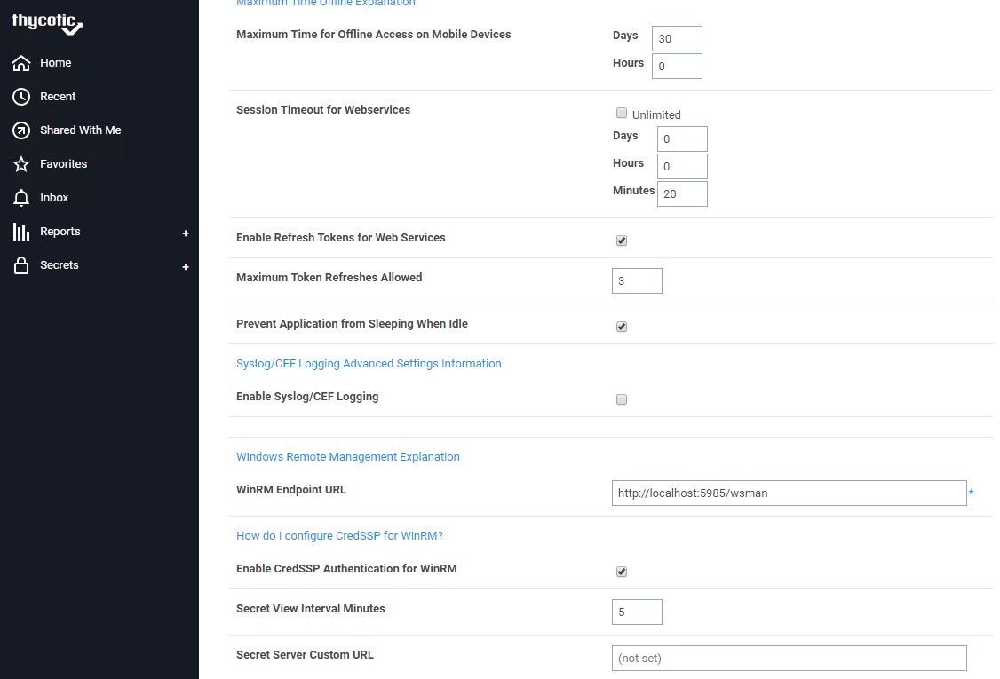
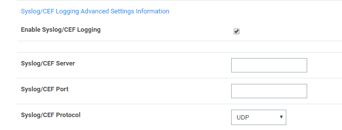

[title]: # (Secret Server)
[tags]: # (witfoo,secret server)
[priority]: # (2)
[display]: # (all)

# What to do in Secret Server

You must configure settings in Thycotic Secret Server for WitFoo to fetch
syslogs.

To configure Secret Server settings:

1.  Sign into **Secret Server**.

The **All Secrets** page appears.

1.  Click **Admin** \> **Configuration**.

    

    The **Configuration** page appears.

    

1.  At the bottom of the page, click **Edit**.

    

    The **Edit Configuration** page appears.

    

1.  Under **Syslog/CEF Logging Advanced Settings Information** area, select
    **Enable Syslog/CEF Logging** check box.

    

1.  Configure the following settings:

    

-   In the **Syslog/CEF Server** box**,** type the **IP address** of the WitFoo
    virtual appliance.

-   In the **Syslog/CEF Port** box, type the **port number** of the WitFoo
    virtual appliance.

-   In the **Syslog/CEF Protocol** list, select the **protocol**.

1.  Click **Save**.

    You will start receiving event logs. For example, in Secret Server, if you
    have created a user and assigned a role to the user, those logs are
    populated in the WitFoo virtual appliance.
